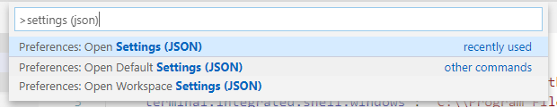

# VSCode

## settings.json

## vscode variables

[vscode variables reference](https://code.visualstudio.com/docs/editor/variables-reference) 

## environment variables

[setting environment variables](https://docs.microsoft.com/en-us/dotnet/api/system.environment.setenvironmentvariable)  
keep in mind that machine environment variables can easily be set through the windows GUI control panel >> system >> advanced system settings >> environment variables
